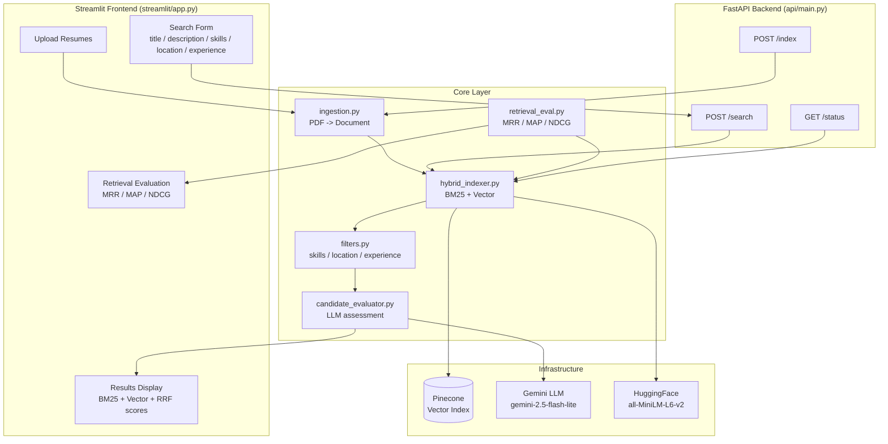
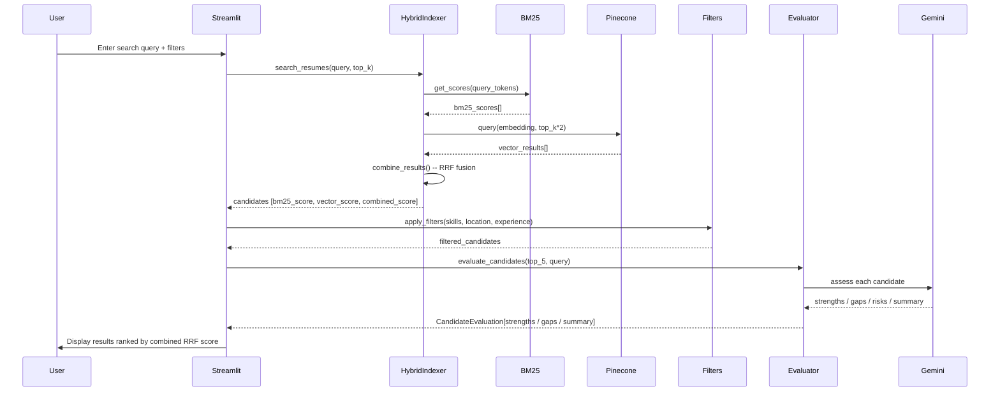

# HireFlow System Architecture

## Overview

HireFlow is a resume-only AI candidate search engine. It indexes PDF resumes using both BM25 (lexical) and Pinecone vector (semantic) search, fuses results with Reciprocal Rank Fusion (RRF), applies post-search filters, and adds a qualitative Gemini assessment to the top results. Candidates are ranked by the retrieval scores alone — the LLM explains matches, it does not score them.

The system is split into a **FastAPI backend** (handles indexing and search) and a **Streamlit frontend** (handles UI). Both can run independently.

---

## System Diagram



---

## Data Flow



---

## Scoring Pipeline

```
Resume text
    |
    +---> BM25 (rank_bm25)
    |         BM25 raw score
    |         normalized to [0,1]: score / max_score
    |
    +---> Pinecone (cosine similarity)
              Vector score in [0,1]
    |
    v
Reciprocal Rank Fusion (RRF)
    rrf_score = 1 / (60 + rank)
    candidates in both lists get scores summed
    |
    v
combined_score (RRF) -- used for initial ranking
    |
    v
Post-Search Filters (optional)
    skills / location / min_experience
    |
    v
LLM Evaluation (optional, top-5 only)
    qualitative only: strengths / gaps / risks / summary
    produces no score and does not reorder results
```

---

## Component Descriptions

| Component | File | Responsibility |
|---|---|---|
| FastAPI Backend | `api/main.py` | REST endpoints for index/search/status |
| HybridIndexer | `core/hybrid_indexer.py` | Orchestrates BM25 + Pinecone + RRF |
| VectorStore | `core/vector_store.py` | Pinecone upsert and query |
| Ingestion | `core/ingestion.py` | PDF -> LangChain Document |
| ResumeParser | `core/parsing.py` | LLM-based structured field extraction |
| CandidateEvaluator | `core/candidate_evaluator.py` | Gemini qualitative assessment (no scoring) |
| Filters | `core/filters.py` | Post-search filtering (skills/location/exp) |
| retrieval_eval | `core/retrieval_eval.py` | MRR/MAP/NDCG and the evaluation runner |
| SearchQuery | `utils/schemas.py` | Lightweight query context dataclass |
| Resume | `utils/schemas.py` | Pydantic resume model |
| CandidateEvaluation | `utils/schemas.py` | Pydantic evaluation result model |

---

## Candidate Evaluation Detail

The evaluator is deliberately **not** a scorer. Candidates are ranked only by the
three retrieval scores (BM25, vector, RRF). A fourth number derived from LLM prose
competed with those and obscured what they meant, so it was removed.

### LLM path (Gemini available)
```
1. Gemini extracts: 3 strengths, 3 gaps, any risks, summary
2. Those are returned verbatim as a CandidateEvaluation
3. Input order is preserved — callers pair evaluations with
   candidates by position, and candidates arrive in RRF order
```

### Fallback path (LLM unavailable)
```
Strengths: candidate has required skills
Gaps:      candidate missing required skills
```

---

## Startup Behaviour (Streamlit)

Startup does **no** indexing. On cold start, `SystemManager.initialize()`:
1. Initialises Pinecone and the local embedding model
2. Calls `load_index()`, which reads `data/hybrid_index/corpus.pkl` and rebuilds
   BM25 in memory

That is the whole sequence: no PDF reads, no Gemini calls, no Pinecone writes.
Indexing is a separate, explicit step (`index_resumes.py`), because it costs one
Gemini call per resume and should be paid once rather than on every launch.

If no index exists, the app says so and shows the command instead of silently
indexing. The sidebar offers **Index new resumes** (incremental) and **Force full
rebuild**, both running the same `core/indexing_service.py` as the CLI.

---

## Offline Evaluation

`core/retrieval_eval.py` scores retrieval quality against fixed test cases in
`data/eval/test_cases.json`. Each case pairs a query with the skills that make a
candidate relevant; ground truth is resolved from the indexed metadata.

```
test case ──> hybrid search ──> ranked candidate ids
                                      |
                                      v
                          core/retrieval_eval.py
                          MRR  first hit position only
                          MAP  precision at every hit
                          NDCG log-discounted, normalised
```

No LLM is involved — this measures retrieval, not answer quality. Run it with
`python evaluate_retrieval.py` or from the sidebar's **Retrieval Evaluation**
page.

---

## Running Tests

```bash
pytest tests/ -v
```

All tests use `unittest.mock` — no live Pinecone or Gemini calls.

| Test file | Covers |
|---|---|
| `tests/test_filters.py` | skills / location / experience filtering |
| `tests/test_hybrid_indexer.py` | BM25 indexing, RRF fusion, score normalization |
| `tests/test_candidate_evaluator.py` | LLM assessment, rule-based fallback, section parsing |
| `tests/test_retrieval_eval.py` | MRR / MAP / NDCG, with worked examples |
| `tests/test_indexing_service.py` | Incremental + forced indexing, zero-cost startup |
| `tests/test_ingestion.py` | PDF loading and metadata extraction |
